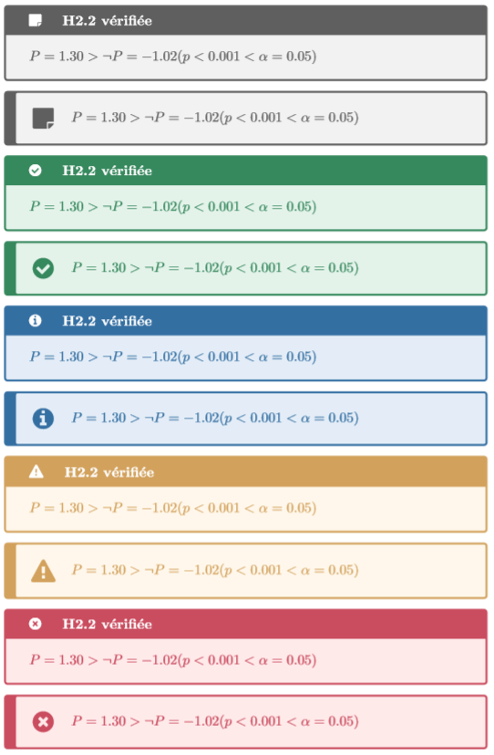
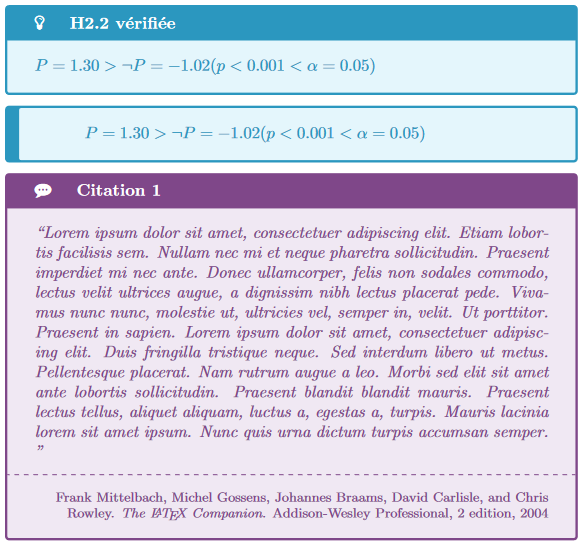

Small latex package to write colored box with icons (using tcolorbox and fontawesome)

```tex
    \begin{card}[note][H2.2 vérifiée]
        $P = 1.30 > \neg P = -1.02 (p < 0.001 < \alpha = 0.05)$  
    \end{card}

    \begin{card}[note]
        $P = 1.30 > \neg P = -1.02 (p < 0.001 < \alpha = 0.05)$  
    \end{card}
    
    \begin{card}[check][H2.2 vérifiée]
        $P = 1.30 > \neg P = -1.02 (p < 0.001 < \alpha = 0.05)$  
    \end{card}

    \begin{card}[check]
        $P = 1.30 > \neg P = -1.02 (p < 0.001 < \alpha = 0.05)$  
    \end{card}
    
    \begin{card}[info][H2.2 vérifiée]
        $P = 1.30 > \neg P = -1.02 (p < 0.001 < \alpha = 0.05)$  
    \end{card}

    \begin{card}[info]
        $P = 1.30 > \neg P = -1.02 (p < 0.001 < \alpha = 0.05)$  
    \end{card}
    
    \begin{card}[warning][H2.2 vérifiée]
        $P = 1.30 > \neg P = -1.02 (p < 0.001 < \alpha = 0.05)$  
    \end{card}

    \begin{card}[warning]
        $P = 1.30 > \neg P = -1.02 (p < 0.001 < \alpha = 0.05)$  
    \end{card}
    
    \begin{card}[error][H2.2 vérifiée]
        $P = 1.30 > \neg P = -1.02 (p < 0.001 < \alpha = 0.05)$  
    \end{card}

    \begin{card}[error]
        $P = 1.30 > \neg P = -1.02 (p < 0.001 < \alpha = 0.05)$  
    \end{card}
```



```tex
    \begin{card}[idea][H2.2 vérifiée]
        $P = 1.30 > \neg P = -1.02 (p < 0.001 < \alpha = 0.05)$  
    \end{card}

    \begin{card}[idea]
        $P = 1.30 > \neg P = -1.02 (p < 0.001 < \alpha = 0.05)$  
    \end{card}
    
    \citecard{latex:companion}{\blindtext}
```



# Installation
* Add `card.sty` to your latex project
* Need at least following package : `\usepackage[dvipsnames]{xcolor}`
* Add as a regular package : `\usepackage{card}`

# Usage 

See `main.tex` for example and `main.pdf` for the output.
