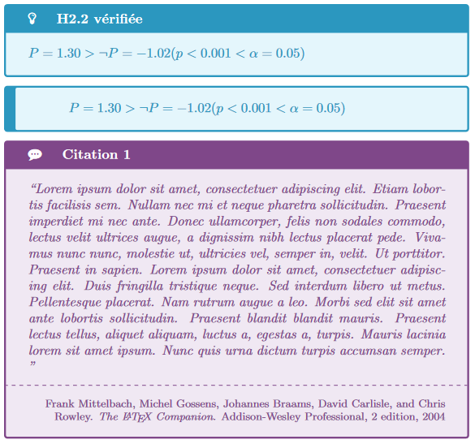

Small latex package to write colored box with icons (using tcolorbox and fontawesome)

# Installation
* Add card.sty to your latex project
* Need a least package : `\usepackage[dvipsnames]{xcolor}`
* Add as a regular package : `\usepackage{card}`

# Usage 

See `main.tex` for example and `main.pdf` for the output.